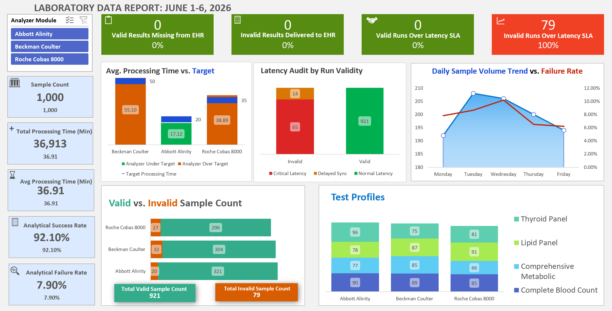
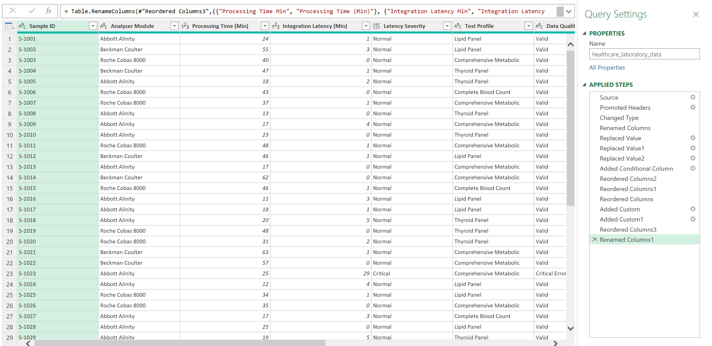
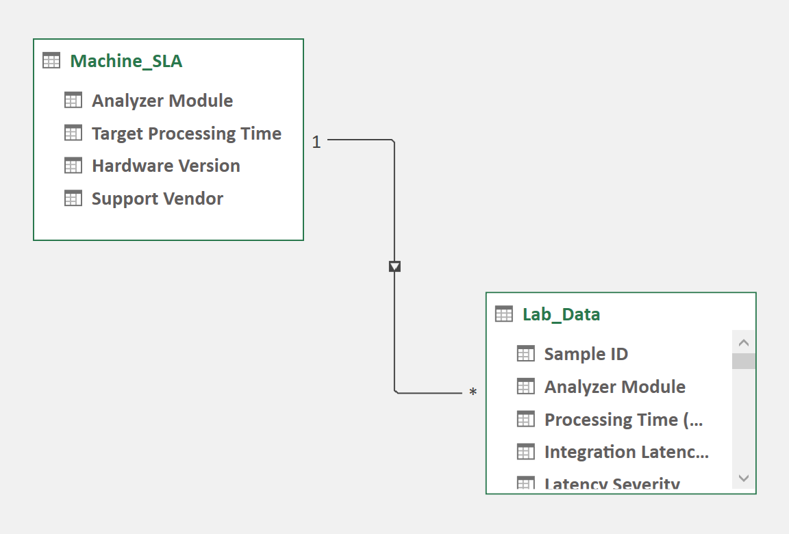
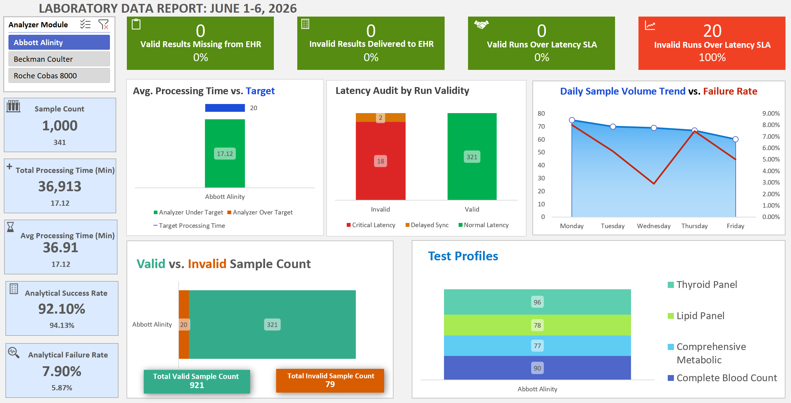

# Clinical Laboratory Operations & Interoperability Troubleshooting Dashboard

**Tech Stack:** Microsoft Excel (Advanced Power Query ETL, Power Pivot Data Modeling, DAX Measure Formulas)

## 🔍 Purpose & Dashboard Type
This portfolio project showcases a robust **Data Analysis, Diagnostic, and Troubleshooting Dashboard** designed for clinical laboratory operations managers, interface engineers, and medical informatics teams. Unlike a static executive summary, this interactive tool is architected to perform root-cause analysis, diagnose hardware throughput constraints, and troubleshoot data sync exceptions across Electronic Health Record (EHR) pipelines.

By shifting from descriptive reporting to diagnostic engineering, this system allows users to interactively trace operational bottlenecks back to specific clinical, mechanical, or interface-driven root causes.

---

## 🛠️ Advanced Technical Competencies Demonstrated
*   **Relational Data Modeling (Power Pivot):** Built a local Data Mart utilizing a Star Schema to bridge a 1,000-row transactional ledger with manufacturer-baseline target benchmarks.
*   **Advanced Data Transformation (Power Query):** Executed clean string parsing on analyzer nomenclature, logic-based chronological profiling (day-of-week rushing analysis), and error-state isolation.
*   **Dynamic DAX Measure Engineering:** Formulated complex dynamic measures to track rolling averages, compliance failure flags, and mechanical processing variances across filtered slicing contexts.
*   **Bi-Directional Handshake Auditing:** Designed strict exception-state matrices to automatically audit system-level data integrity, validating HL7 pipeline behaviors against physical instrument outcomes.

---

## 🔍 Technical Architecture & UI Design

Below is the complete architectural layout of the diagnostic tool, demonstrating the end-to-end data pipeline from raw database ingestion to the final interactive presentation layer.

### 📊 1. The Presentation Layer: Interactive Diagnostic UI
This high-fidelity operational layout isolates key compliance risks in the top ribbon, houses baseline dimension filters on the left pane, and arrays the five core diagnostic charts in the center for active troubleshooting.

---

### 🗂️ The Technical Pipeline (Data Architecture)

The underlying system transformations, data relationships, and schema configurations that power the frontend interface are structured as follows:

| ⚙️ 2. Automated ETL Ingestion (Power Query) | 🔀 3. Relational Schema Data Model (Power Pivot) |
| :--- | :--- |
| Tracks the explicit string-parsing, data-cleaning, and chronological logic-bucketing steps applied to the raw database export. | Establishes a clean, resource-efficient 1-to-Many ($1:\infty$) dimensional link to dynamically map business benchmarks. |
|  |  |

---

### 🎛️ 4. Dynamic Filtering Pane & Slicer Mapping
To isolate specific hardware assets, a global **Analyzer Module Slicer** is anchored to the core layout. This element is cross-mapped to all underlying pivot caches, dynamically shifting every rate, trend, and SLA calculation on the screen across active filtering contexts.

## 📈 Diagnostic Metric Framework

### 🚨 System Integrity & Compliance Troubleshooting (Top of Dashboard)
*   **Valid Results Missing from EHR (Count & %):** Diagnoses **Network/IT Drops** — tracking valid clinical runs that failed to reach patient charts due to HL7 mapping issues or connection port timeouts (0.0% achieved baseline). This is to ensure that all valid results have successfully been delivered to EHR.
*   **Invalid Results Delivered to EHR (Count & %):** Diagnoses **Critical Patient Safety Releases & Compliance** — verifying that unvalidated or erroneous results were successfully intercepted by LIS middleware (0.0% leak rate).
*   **Valid Runs Over Latency SLA (Count & %):** Diagnoses **Network Traffic Drag** by counting pristine runs exceeding standard automated transmission baselines (>5 minutes).
*   **Invalid Runs Over Latency SLA (Count & %):** Diagnoses **Manual Troubleshooting Bottlenecks** — measuring how long laboratory staff take to resolve, cancel, or log redraw requests on electronic holds following hardware flags.

### ⏱️ Core Process Drivers (Left of Dashboard)
*   **Total & Average Instrument Processing Time:** Pinpoints mechanical, centrifugation, and incubation delays across individual units.
*   **Analytical Success vs. Failure Rate:** Quantifies overall specimen quality and instrument calibration reliability.
*   **Avg Exception Resolution Latency:** Isolates the human operational clock — tracking the exact duration a compromised tube remains locked on an electronic hold before manual intervention.

---

## 🧬 Diagnostic Case Studies

### 1. Root-Cause Analysis: Instrument Hold vs. Network Downtime
Cross-field verification across 1,000 continuous sample profiles reveals a perfect 1-to-1 match between "Data_Quality_Flag = Critical_Error" and "Verified_To_EHR = No". 

This proves that **zero data loss was caused by IT infrastructure crashes or HL7 server rejections (AE/AR codes)**. Instead, rejections are 100% driven by clinical sample compromises (e.g., sample clots, insufficient blood draws). 

The dashboard clearly diagnoses that high integration latency is not network lag—it. It is from the **Manual Troubleshooting Window** required for medical technologists to verify and cancel compromised samples.

### 2. Identifying the "Hidden Drag" of Instrument Re-runs
By linking a separate manufacturer benchmarking table to our active transactional data via Power Pivot, the **Average Processing Time vs. Target** bar chart diagnoses hidden productivity sinks. 

Samples that ultimately resolve as "Valid" but show massive positive variance against processing baselines point to "Hidden Re-runs"—instances where an analyzer suffered minor mechanical glitches (e.g., sample line bubbles), prompting lab techs to run the exact same tube a second time, effectively overwriting the error flag but permanently inflating the operational processing clock. In our dataset, all valid runs were within the normal latency range.

---

## 🚀 How to Explore the Model
1.  Download "LIS_EHR_Interoperability_Diagnostic_Dashboard_v1.xlsx" from this repository.
2.  Open the file and ensure Macros/Data Models are enabled if prompted.
3.  Utilize the **Analyzer Module Slicer** on the left panel to dynamically isolate machine behaviors. Watch how target variances, daily failure trends, and stacked latency profiles instantly rearrange across clinical operational lines.
